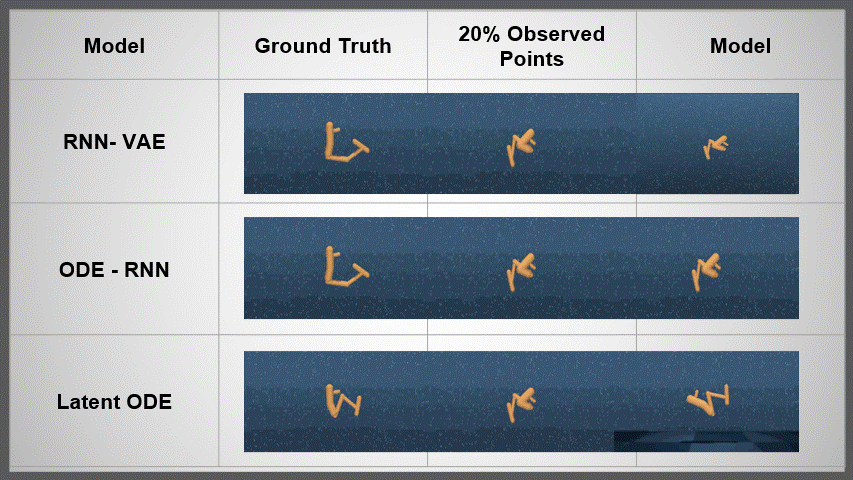

# Mujoco-Dynamics-with-ODE_NN
ODE-Enhanced Neural Network Modeling for Irregularly Sampled Mujoco Dynamics

### Introduction
This project explores the integration of Ordinary Differential Equations (ODEs) with neural networks to model the dynamics of multi-joint systems using the Mujoco dataset. Our focus is on interpolating irregularly sampled data to predict and analyze complex joint movements accurately.

### Dataset
We use the Mujoco simulation to generate a trajectory dataset, which serves as a rich benchmark for simulating multi-joint dynamics. This dataset was then processed to create subsets with irregular sampling intervals, presenting a challenge for our ODE-integrated neural network models.

## Algorithm

In this project, we adapted the methodology from this paper to integrate ODE solvers into our neural network architecture, allowing us to effectively handle the irregularly sampled data in the Mujoco dataset. The core idea involves using ODEs to model the continuous dynamics of the system, which provides a flexible framework for dealing with non-uniform time steps in our dataset.

> Yulia Rubanova, Ricky Chen, David Duvenaud. "Latent ODEs for Irregularly-Sampled Time Series" (2019)
> [[arxiv]](https://arxiv.org/abs/1907.03907)

### Installation
To set up the project locally, follow these steps:

1. Clone the repository:

```
git clone https://github.com/your-username/Mujoco-Dynamics-with-ODE_NN.git
cd Mujoco-Dynamics-with-ODE_NN
```

2. Create a virtual environment and activate it:

```
python -m venv venv
source venv/bin/activate
```

3. Install the required dependencies:

```
pip install -r requirements.txt
```

### Important Files:
- Main Training File for all models:
  ```
  src/final_project.ipynb
  ```
- Dataset generation script using Mujoco for Walker -
  ```
  notebooks/Walker_data_collection.ipynb
  ```

### Visualizing the trajectories before and after training in Hopper:
<p align="center">

</p>


### References:
[RNN- VAE ](https://medium.com/aiguys/variational-recurrent-neural-networks-vrnns-3b836adad399) <br>
[Latent ODE main repo](https://github.com/YuliaRubanova/latent_ode/tree/master?tab=readme-ov-file) <br>


